# 🛡️ Laboratorio FSSO (Fortinet Single Sign-On)

Este repositorio documenta la implementación de **FSSO** (*Fortinet Single Sign-On*) utilizando un servidor Windows con Active Directory. El objetivo es que los usuarios se autentiquen una única vez en el dominio y el FortiGate sea capaz de identificarlos automáticamente para aplicar políticas de acceso a internet basadas en el usuario o grupo al que pertenecen.

En este laboratorio se utiliza el **modo Collector Agent con DC Agent**, que es el método recomendado por Fortinet al ser el que menor carga genera sobre los controladores de dominio.

---

## 🏗️ Topología

La topología desplegada en GNS3 conecta el FortiGate con un servidor Windows Server que actúa como Controlador de Dominio (DC). Los clientes se unen al dominio y cuando inician sesión, el FortiGate recibe automáticamente la información de qué usuario corresponde a cada IP.

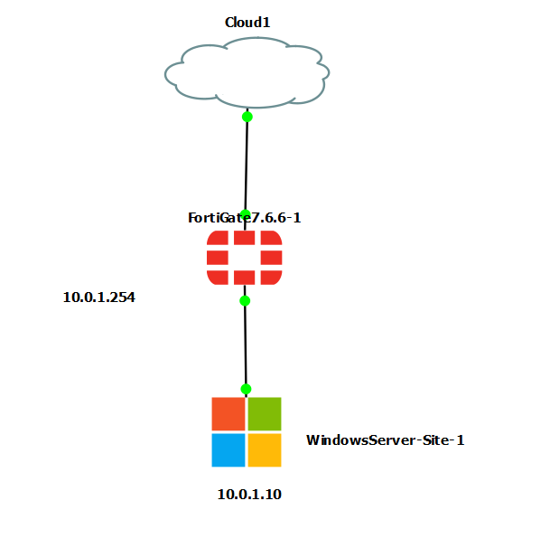

**Flujo de funcionamiento del FSSO:**
1. El usuario inicia sesión en el dominio Windows.
2. El **DC Agent** detecta el evento de login y envía la asignación `IP → Usuario` al **Collector Agent**.
3. El **Collector Agent** reenvía esta información al FortiGate.
4. El FortiGate aplica las políticas de firewall correspondientes al grupo del usuario.

---

## 👥 Configuración del Active Directory

### Usuarios y Grupos creados

Se han creado dos grupos en el Active Directory con un usuario asignado a cada uno:

**Grupo: Ciberseguridad**

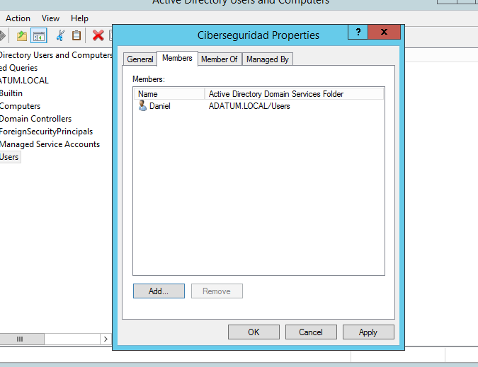

**Grupo: Administracion**

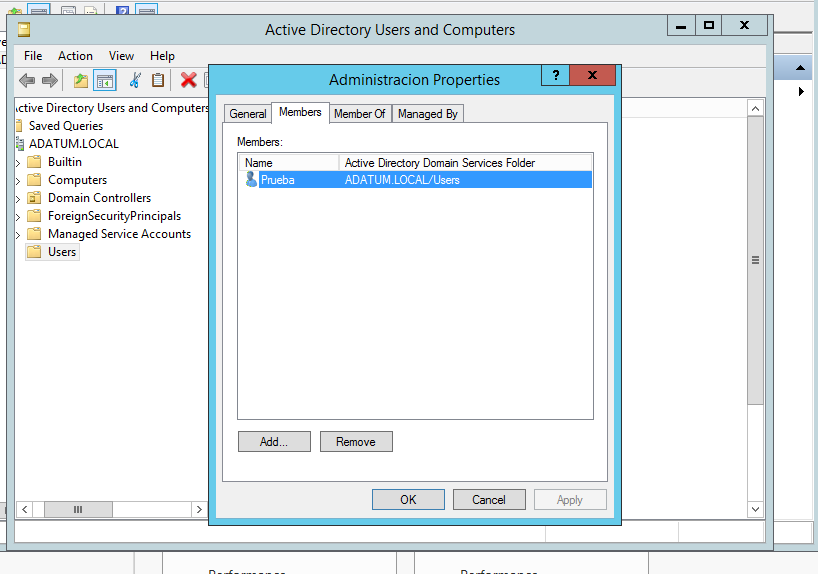

**Usuario `daniel`** pertenece al grupo **Ciberseguridad** y tendrá acceso completo a internet.

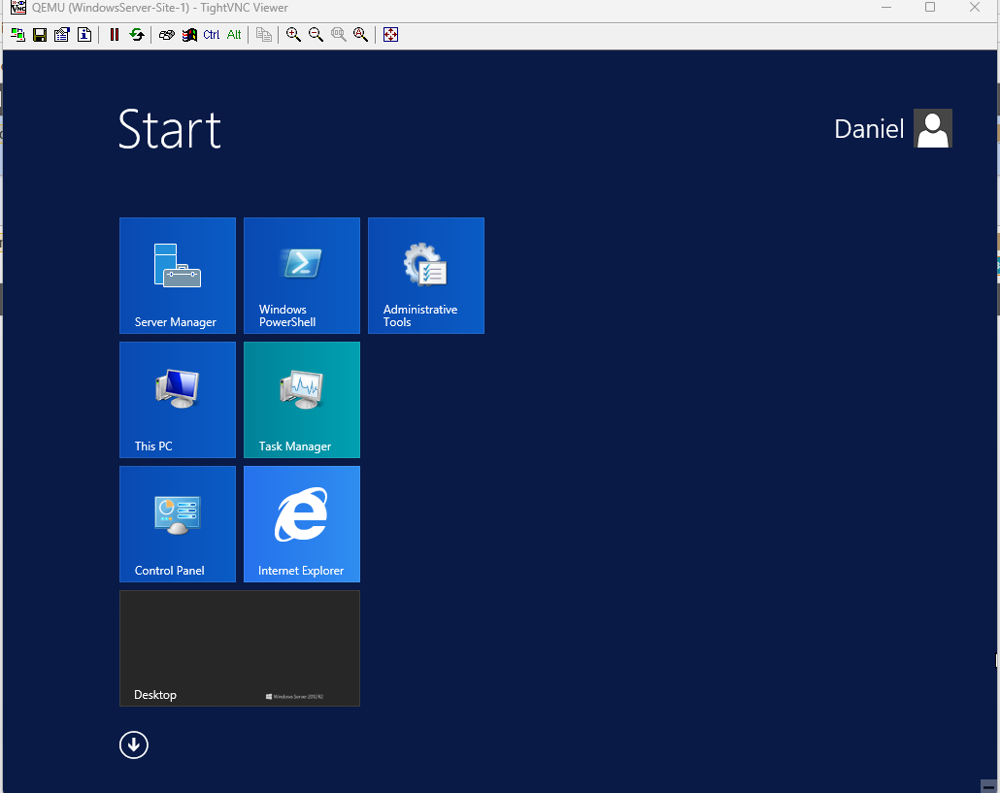

**Usuario `prueba`** pertenece al grupo **Administracion** y tendrá bloqueado el acceso a Facebook.

---

## ⚙️ Instalación y Configuración del DC Agent

El **DC Agent** se instala directamente en el Controlador de Dominio. Su función es monitorizar los eventos de inicio de sesión del sistema operativo Windows y comunicar en tiempo real al Collector Agent qué usuario ha iniciado sesión y desde qué IP.

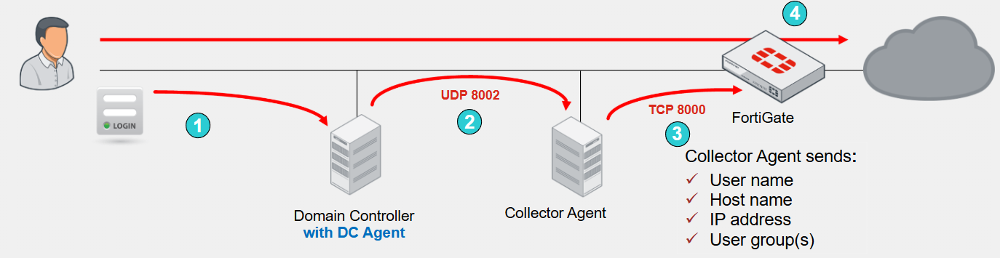

> [!IMPORTANT]
> El DC Agent debe instalarse en **cada Controlador de Dominio** del entorno. Si hay múltiples DCs y alguno no tiene el agente, el FortiGate podría no recibir todos los eventos de autenticación.

---

## 🔗 Configuración del FortiGate

### Paso 1: Fabric Connector — Conexión con el Collector Agent

En el FortiGate se configura el conector FSSO apuntando a la IP del Collector Agent. Este conector es el canal por el que el FortiGate recibe las actualizaciones de sesiones de usuario.

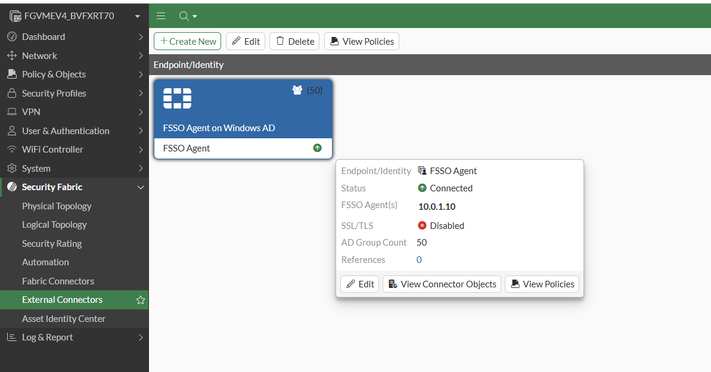

### Paso 2: Grupos de Usuarios en FortiGate

Una vez establecida la conexión con el Collector Agent, el FortiGate puede importar los grupos del Active Directory. Se crean dos grupos de usuarios que mapean directamente con los grupos del dominio:

- **Ciberseguridad** → grupo AD `Ciberseguridad`
- **Administracion** → grupo AD `Administracion`

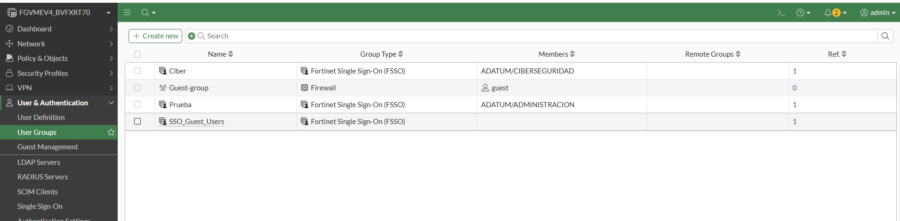

### Paso 3: Perfil de Web Filter

Para restringir el acceso a Facebook al grupo **Administracion**, se crea un perfil de **Web Filter** que bloquea la categoría de redes sociales o específicamente el dominio de Facebook.

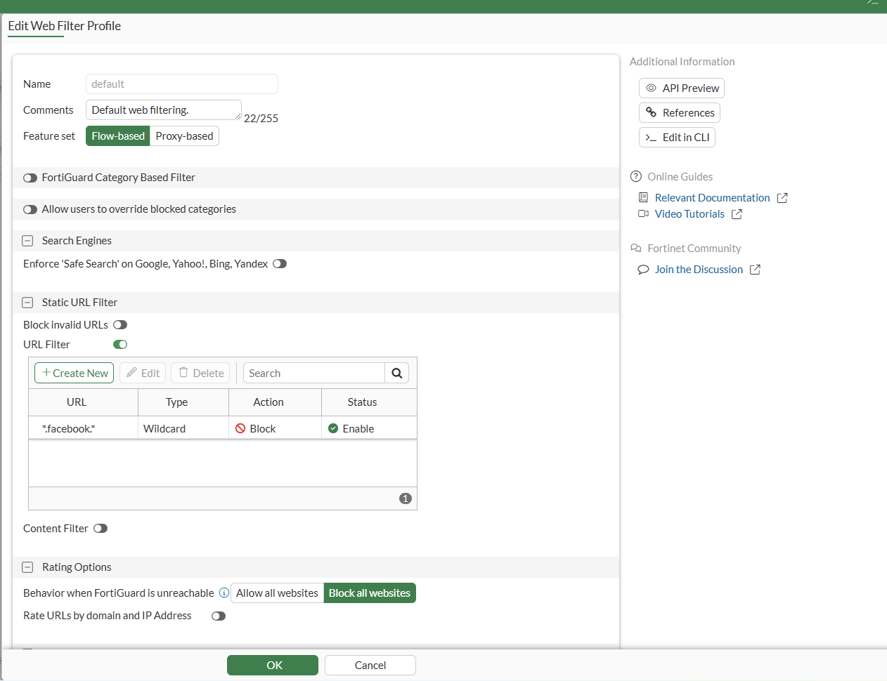

### Paso 4: Políticas de Firewall por Grupo

Se crean políticas de firewall diferenciadas para cada grupo. El orden de las políticas es importante: se evalúan de arriba a abajo.

| Política | Origen | Grupo | Destino | Web Filter |
|---|---|---|---|---|
| Acceso Administracion | LAN | Administracion | WAN | Sí (bloquea Facebook) |
| Acceso Ciberseguridad | LAN | Ciberseguridad | WAN | No |

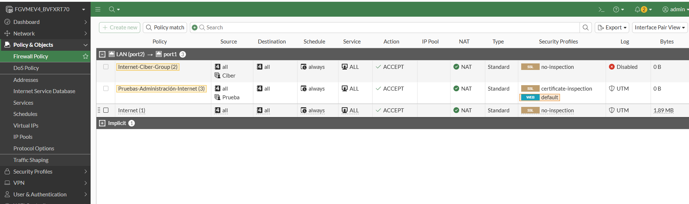

> [!TIP]
> Al añadir los grupos FSSO directamente en el campo **Source** de la política, el FortiGate aplica automáticamente la regla correcta según el usuario que inició sesión, sin necesidad de autenticación adicional en el portal cautivo.

---

## 🧪 Pruebas de Funcionamiento

### Prueba 1: Usuario `daniel` (Grupo Ciberseguridad)

El usuario `daniel` inicia sesión en el dominio y navega libremente por internet. El FortiGate le identifica como perteneciente al grupo **Ciberseguridad** y le aplica la política sin restricciones web.

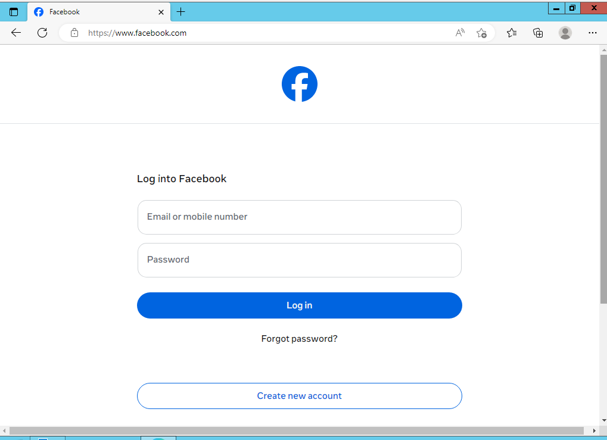

### Prueba 2: Usuario `prueba` (Grupo Administracion) — Acceso General

El usuario `prueba` tiene acceso a internet en general gracias a la política del grupo **Administracion**.

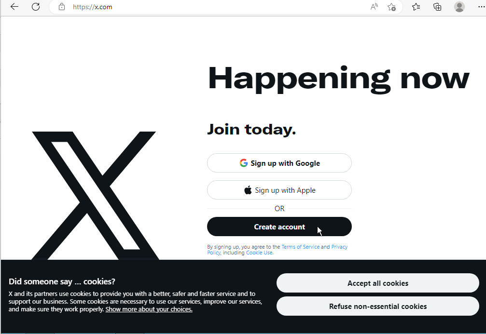

### Prueba 3: Usuario `prueba` — Bloqueo de Facebook

Sin embargo, al intentar acceder a Facebook, el FortiGate intercepta la solicitud y la bloquea al aplicar el perfil de Web Filter asociado a la política del grupo **Administracion**.

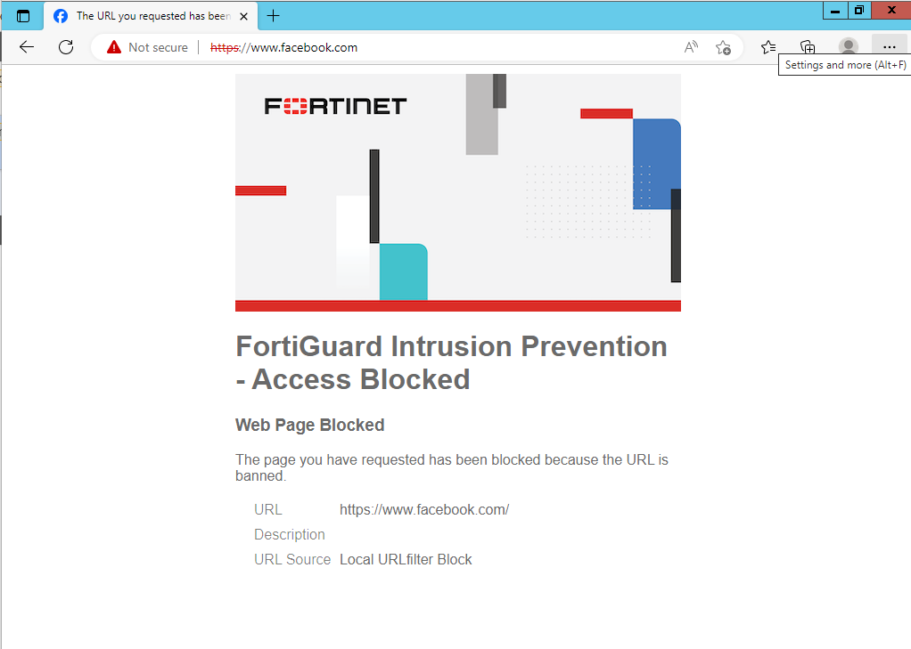

### Prueba 4: Verificación en los Logs del FortiGate

En los registros del FortiGate se puede confirmar el bloqueo, viendo el usuario de dominio, la IP de origen y la URL denegada.

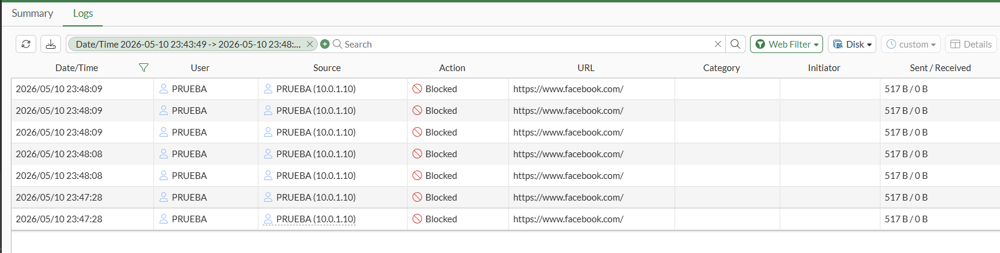

---

## 🎯 Conclusión

Con este laboratorio se ha demostrado cómo el **FSSO en modo Collector Agent con DC Agent** permite al FortiGate aplicar políticas de seguridad granulares basadas en la identidad del usuario, sin necesidad de que este se vuelva a autenticar. El proceso es completamente transparente para el usuario final: simplemente inicia sesión en Windows y el FortiGate ya sabe quién es y qué políticas debe aplicarle.

Esto es especialmente útil en entornos corporativos donde se quiere diferenciar el acceso a internet según el departamento o rol del empleado, como en este caso, donde el grupo **Administracion** tiene restringido el acceso a redes sociales mientras que **Ciberseguridad** mantiene acceso completo.
