# 🛡️ Laboratorio Antivirus Fortigate

Este repositorio contiene documentación sobre la implementación de un laboratorio en GNS3. El objetivo es crear un servidor Apache con archivos que contienen firmas de virus para analizar los distintos comportamientos que tiene Fortigate a la hora de intentar bloquearlos.

---

## 🌐 Topología

El propósito de esta topología es desplegar un servidor Apache que aloje archivos infectados. El cliente intentará descargarlos y el Fortigate deberá interceptarlos y eliminarlos. 

> **⚠️ El Problema de la Visibilidad:** > Un gran porcentaje de las descargas web actuales se realizan bajo **HTTPS**. Sin una inspección profunda (*Deep SSL Inspection*) —la cual no viene por defecto en las políticas—, Fortigate no será capaz de ver el contenido de lo que el cliente solicita. En este ámbito, **el Fortigate es "ciego"**. 

Con este laboratorio quiero concienciar de que, si tienes un perfil de seguridad de Antivirus pero no tienes una inspección profunda de SSL habilitada, el Fortigate será incapaz de analizar la gran mayoría de recursos web que se solicitan hoy en día.

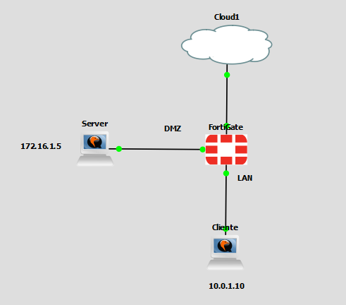

---

## ⚙️ Configuración

Este laboratorio no tiene tanta configuración como los anteriores, pero me parece vital para ver cómo se comporta el Fortigate ante estas situaciones reales, las cuales suelen ser un gran foco de problemas en algunas empresas.

### Paso 1: Perfil Antivirus
En el Fortigate, creo un nuevo perfil Antivirus que bloquea las firmas de virus que detecte en el tráfico HTTP.

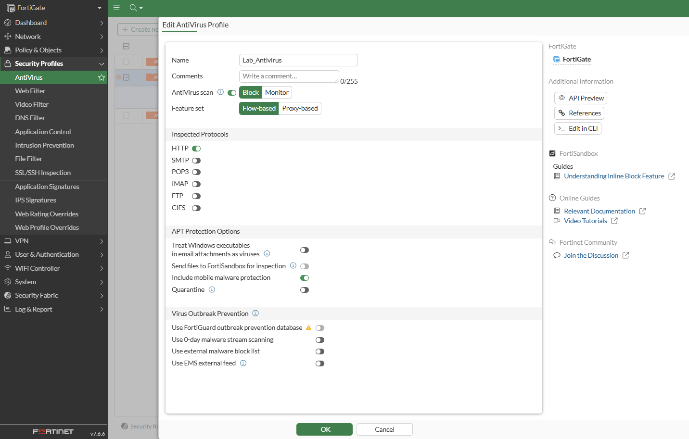

### Paso 2: Política de Firewall
Creo una política que admita el tráfico que entra desde la LAN interna y sale por la DMZ hacia el servidor, y le añado el perfil Antivirus creado anteriormente. 
*Primero le dejo el modo de inspección en `certificate-inspection` para ver cómo se comporta.*
 
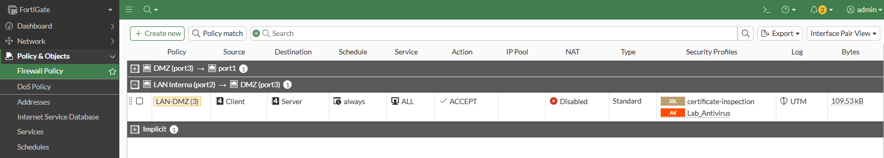

---

## 🧪 Pruebas de Antivirus

### Prueba 1: Tráfico sin cifrar (HTTP)
Una vez configurado el Fortigate, instalo Apache en el servidor y creo un archivo que contenga una firma de antivirus (en internet se pueden encontrar de prueba). Una vez lo tenemos, hacemos una búsqueda al servidor desde el cliente.

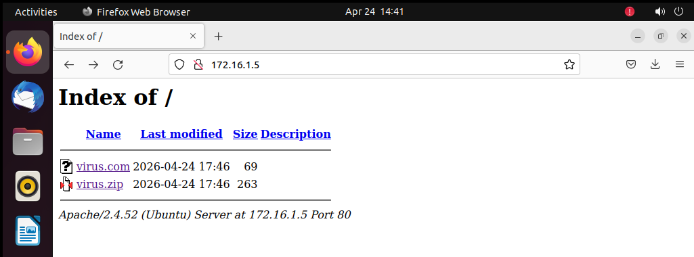

Esta vez busco la página del servidor por **HTTP** (también es accesible por HTTPS), e intento descargar el fichero con el virus. Se puede comprobar que el Fortigate bloquea la descarga exitosamente porque el tráfico **no va cifrado**.

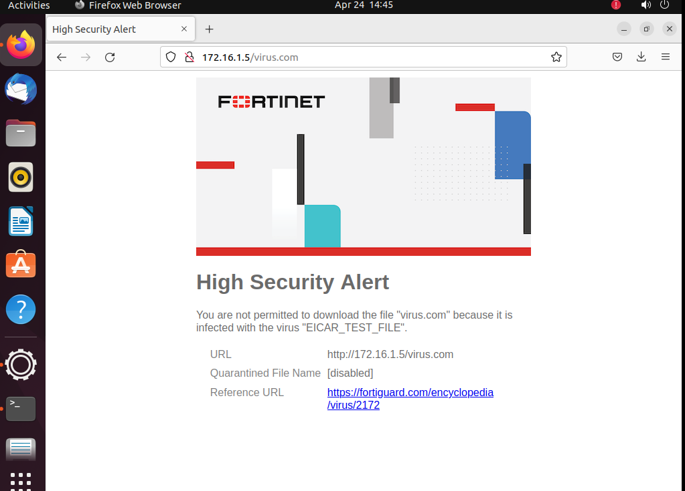

### Prueba 2: Tráfico cifrado (HTTPS sin Deep Inspection)
Ahora vamos a hacer la prueba descargando el fichero, pero esta vez estableciendo una comunicación **HTTPS** con el servidor.

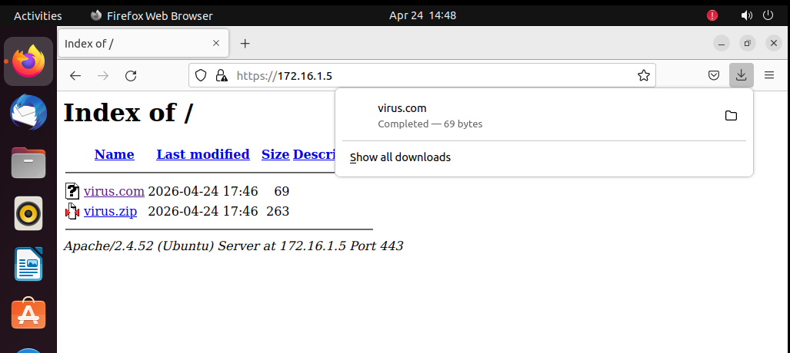

> **❓ ¿Por qué pasa el virus?**
> El modo de inspección de la política está en `certificate-inspection`. Esto significa que el Fortigate únicamente verifica la cabecera del mensaje (quién emite el certificado, quién lo firma, etc.), pero **no descifra** lo que el cliente solicita en su interior, por lo que el virus pasa libremente.

---

## 🔍 Activando Deep Inspection

Voy al Fortigate y cambio el modo de inspección en la política, pasando de `certificate-inspection` a `deep-inspection`.

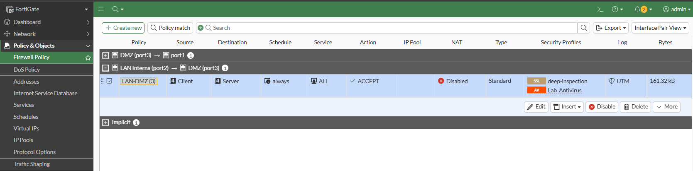

> **⚙️ ¿Qué hace esto exactamente?**
> Básicamente lo que el Fortigate hace es actuar como un proxy (Man-in-the-Middle). Intercepta la solicitud, descifra el contenido, lo lee y lo analiza. Como consecuencia de haber abierto y leído el contenido, el certificado original que emite el servidor pierde su integridad y deja de ser válido, por lo que el Fortigate lo reemplaza poniendo **su propio certificado autofirmado**.

### Gestión de Errores de Certificado
Al ser un certificado autofirmado y no venir de una Autoridad Certificadora (CA) pública conocida, al cliente le va a salir una pantalla advirtiendo que el sitio no es de confianza.

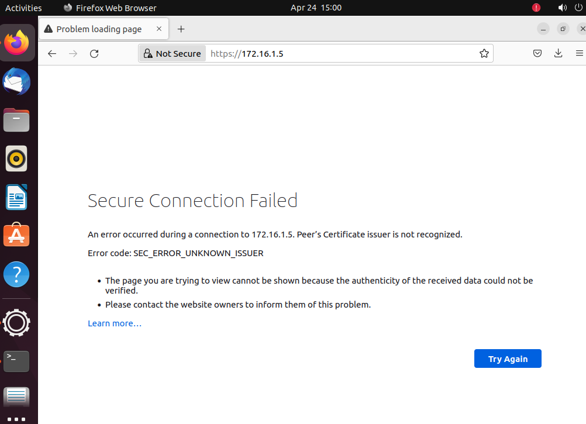

En algunos casos esto genera un *warning* que permite al usuario continuar con el acceso, pero en mi caso es una denegación de acceso total a la página debido a las estrictas restricciones del navegador.

Para solucionar esto hay que descargarse el certificado CA que emite Fortinet en el apartado de *Deep Inspection* e importarlo para que el navegador del cliente confíe en él.

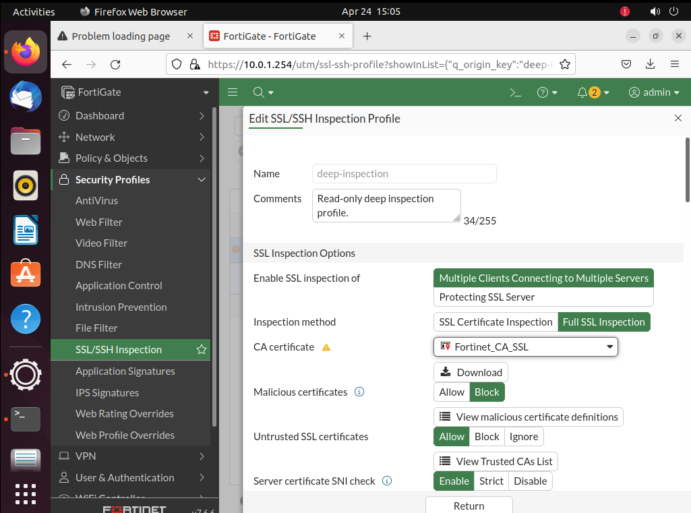

Una vez descargado, se importa en el navegador:

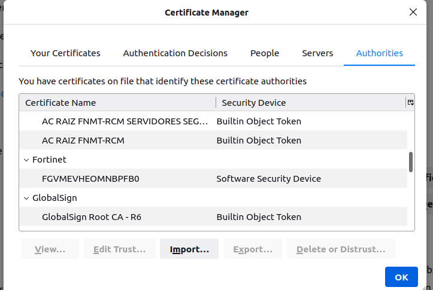

### Prueba 3: Tráfico cifrado (HTTPS con Deep Inspection)
Ahora comprobamos que el navegador nos deja acceder a la página del servidor correctamente por HTTPS sin lanzar alertas, ya que nuestro equipo ahora confía en el certificado emitido por Fortinet.

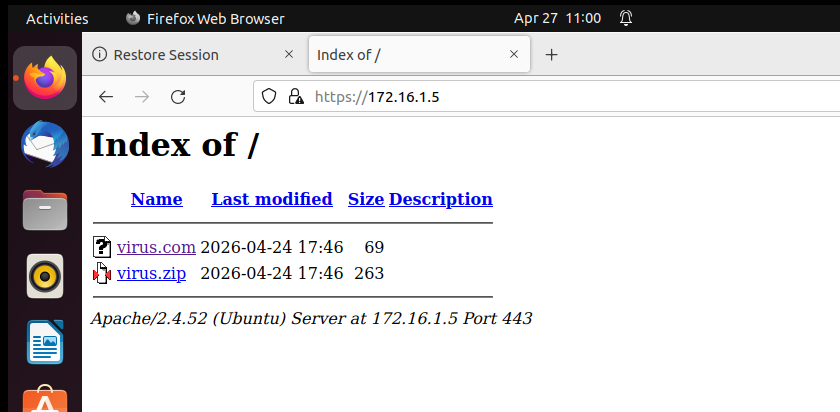

Probamos a descargar de nuevo el virus y comprobamos que **ahora sí nos lo bloquea**. El Fortigate está abriendo e inspeccionando el tráfico a pesar de estar cifrado.

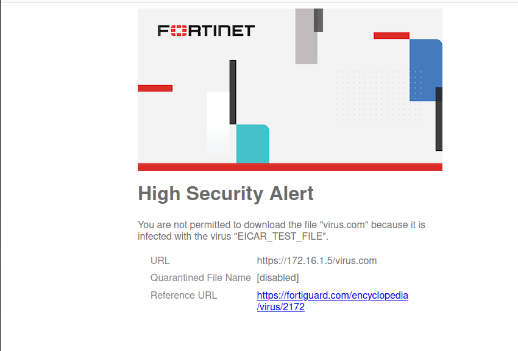

---

## 🎯 Conclusión

Con esta práctica se ha comprobado visual y técnicamente la importancia de entender los conceptos de **inspección SSL** en las políticas de firewall, y cómo estos aplican directamente para que los perfiles de seguridad (como el Antivirus) puedan hacer realmente su trabajo en redes modernas.