# 🛡️ Laboratorio FortiGate HA (High Availability) en GNS3

Este repositorio contiene la documentación detallada para la implementación de un clúster de alta disponibilidad (HA) utilizando FortiGate dentro del simulador GNS3.

## 🎯 Objetivo
El objetivo de este laboratorio es crear un clúster de dos FortiGates (uno en modo **Activo** y otro en **Pasivo**). Esto permite promover la redundancia: en caso de que el nodo activo falle, el nodo en standby toma el control de forma automática para gestionar el tráfico sin interrupciones.

---

## 🏗️ Topología

Para este despliegue se ha utilizado la siguiente arquitectura:
* **Switch de Administración:** Conecta el equipo local con ambos FortiGates para asignarles una IP de la LAN local y permitir la gestión vía GUI/HTTPS.
* **Interfaz Heartbeat:** Los FortiGates están conectados directamente para el envío de *keepalives*. Si el activo deja de enviarlos, el pasivo asume el rol principal.
* **Switch de Cliente:** Conecta el clúster con los clientes internos para las pruebas de conectividad.

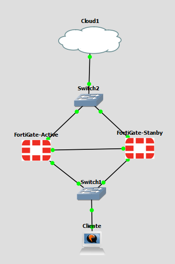

---

## ⚙️ Configuración del Clúster

> [!IMPORTANT]
> Antes de formar un clúster, es indispensable que los dispositivos sean del **mismo modelo** y ejecuten la **misma versión de FortiOS**.

### Pasos Iniciales
Una vez verificados los requisitos, configuramos en cada unidad el modo **HA Activo-Pasivo**.
*(Nota: También existe la opción Activo-Activo, donde ambos procesan tráfico, pero la configuración inicial es muy similar).*

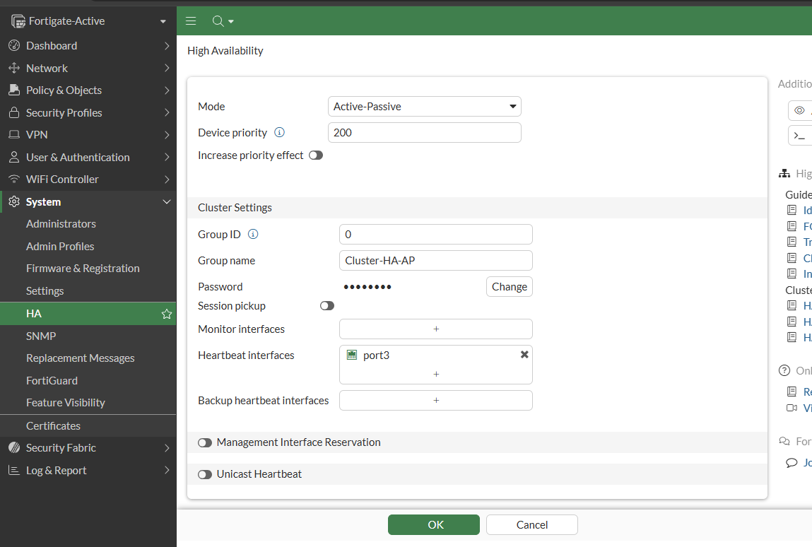

### Sincronización y Prioridad
* **Prioridad:** El FortiGate con mayor prioridad se convierte en el nodo **Activo**. También es posible configurar el sistema para que el nodo con más tiempo de actividad (*uptime*) sea el primario.
* **Proceso:** Al aplicar la configuración, se sincronizan todos los parámetros excepto el *hostname* y las IPs de administración específicas. El proceso finaliza cuando la suma de comprobación (*checksum*) coincide en ambos nodos.

He creado un dashboard con un widget de estado para el HA, donde se comprueba la sincronización:

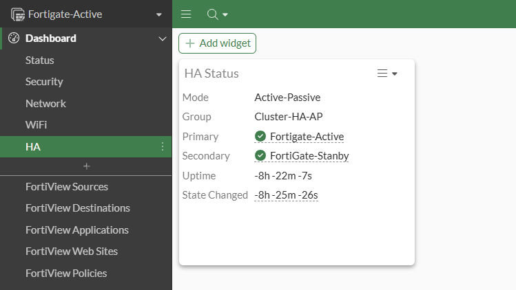

---

## 🖥️ Gestión y Administración

Al estar en clúster, ambos dispositivos comparten la misma configuración, incluso las IPs de las interfaces de datos.

Si consultamos la consola del FortiGate en **standby**, veremos que muestra la IP compartida con el nodo activo:

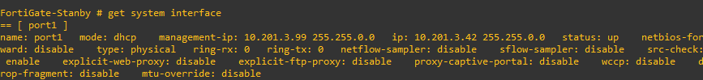

* Si accedemos a la IP `.42` (en este ejemplo), entraremos siempre al **Nodo Activo**.
* Para administrar el nodo **Pasivo** de forma individual mediante la interfaz gráfica, se debe configurar una **IP de administración dedicada** (en este laboratorio, la `.99`).

#### Dashboard Nodo Activo:
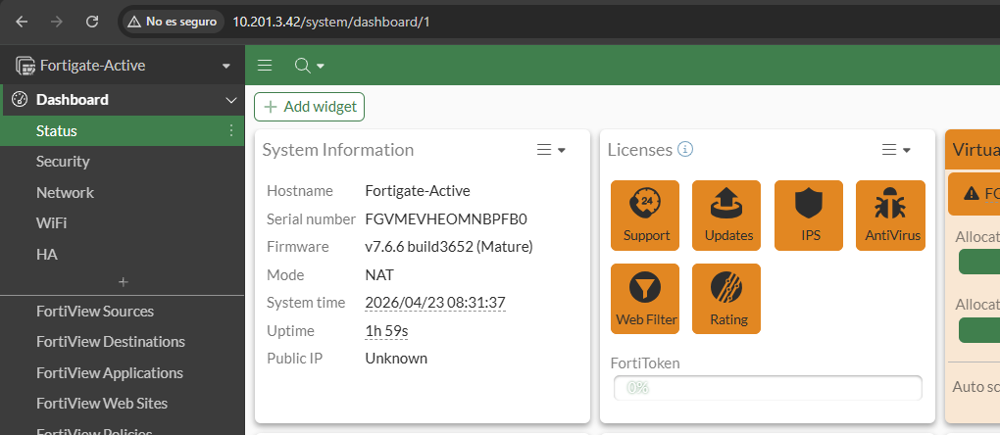

#### Dashboard Nodo Pasivo (vía IP de administración):
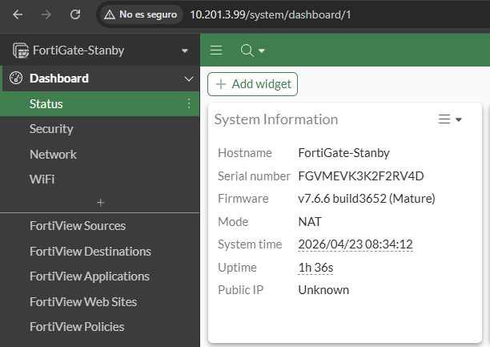

---

## 🧪 Comprobación y Failover

### 1. Configuración de Red
Se ha configurado una ruta por defecto y reglas de firewall para permitir la salida a internet. Gracias a la sincronización del clúster, cualquier cambio en el activo se refleja automáticamente en el pasivo.

* **Ruta Estática:**
    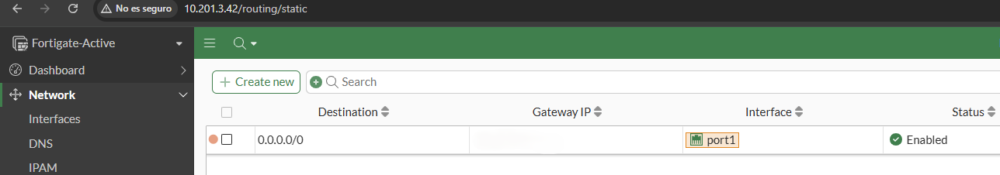
    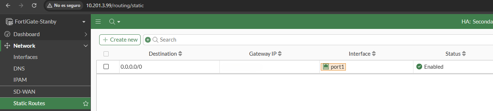

* **Política de Firewall (LAN -> WAN):**
    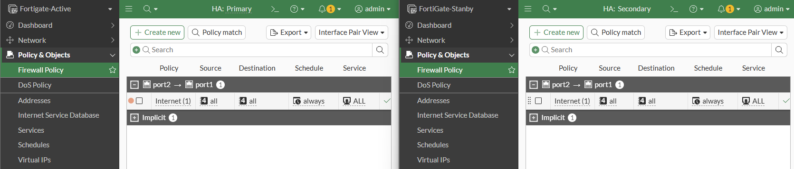

* **Interfaz LAN:**
    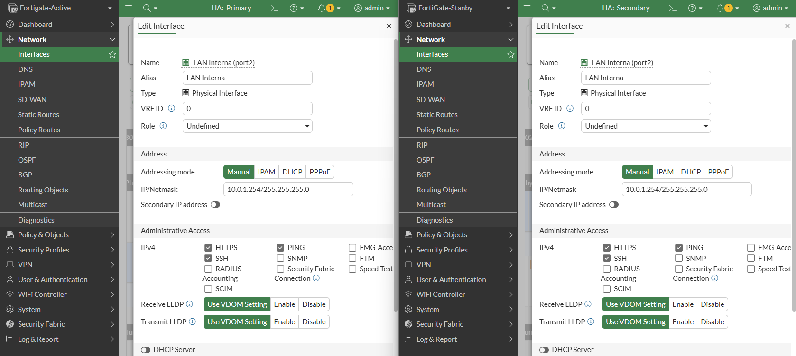

### 2. Prueba de Fallo (Failover Test)
Para validar el funcionamiento, se inicia un **ping infinito** desde el cliente hacia Google (`8.8.8.8`) y se procede a apagar el FortiGate activo.

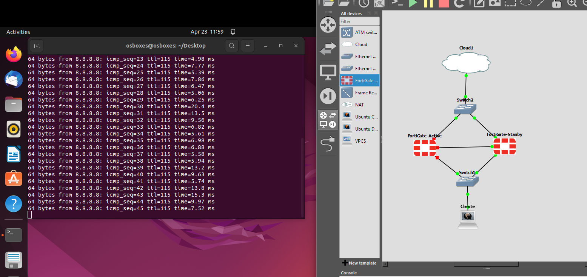

**Resultado:** Como se observa en la captura, a pesar de que el nodo activo original está apagado, el cliente **no ha perdido ni un solo paquete**. El nodo pasivo ha tomado el control de forma instantánea.

### 3. Verificación del nuevo Rol
Al acceder a la IP de gestión del clúster, confirmamos que el dispositivo que antes estaba en standby ahora figura como **Primario**.

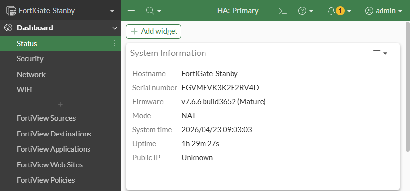

---

## ⚠️ Notas Importantes
> [!TIP]
> **HA Override:** Cuando el FortiGate original (el que tiene mayor prioridad) vuelve a encenderse, no recuperará el rol de activo automáticamente a menos que la opción `ha override` esté activada. Si no está activa, el nodo que tomó el control permanecerá como primario para evitar cortes innecesarios por "flapping".