# Laboratorio de NAT Avanzado en FortiGate: VIPs, IP Pools y VPN Site-to-Site

Este repositorio contiene la documentación detallada sobre la implementación de un laboratorio en GNS3. El objetivo es configurar una arquitectura de red segura utilizando **Virtual IPs (VIPs)** con *Port Forwarding*, **IP Pools** y un túnel **VPN IPsec**.

## 1. Topología y Escenario

El propósito del laboratorio es simular la interconexión entre dos empresas que intercambian servicios (un servidor web en este caso) manteniendo la privacidad de sus redes internas.

**Características principales:**
* **Enmascaramiento mutuo:** Se ocultan tanto la IP real del servidor como la IP real del cliente.
* **Direccionamiento Ficticio:** La comunicación a través de la VPN se realiza mediante IPs mapeadas (ficticias).
* **Seguridad:** Uso de VIPs para evitar la exposición directa de puertos estándar.

## 2. Configuración del Lado del Servidor (Apache-Side)

### 2.1. Configuración de Virtual IP (VIP)
En el FortiGate del servidor, se configura una VIP para mapear la dirección privada real del servidor (`10.0.1.10`) a una IP externa ficticia (`172.118.1.10`). Se habilita **Port Forwarding** para redirigir el tráfico del puerto `8080` externo al puerto `80` interno, evitando exponer puertos conocidos.

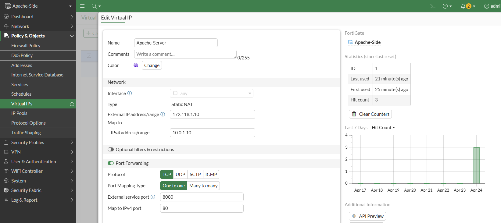

### 2.2. Configuración del Túnel VPN (Fase 1)
La conectividad se establece a través de una interfaz conectada a la red "Cloud" (red interna del laboratorio). Se define el Gateway remoto y la interfaz de salida correspondiente.

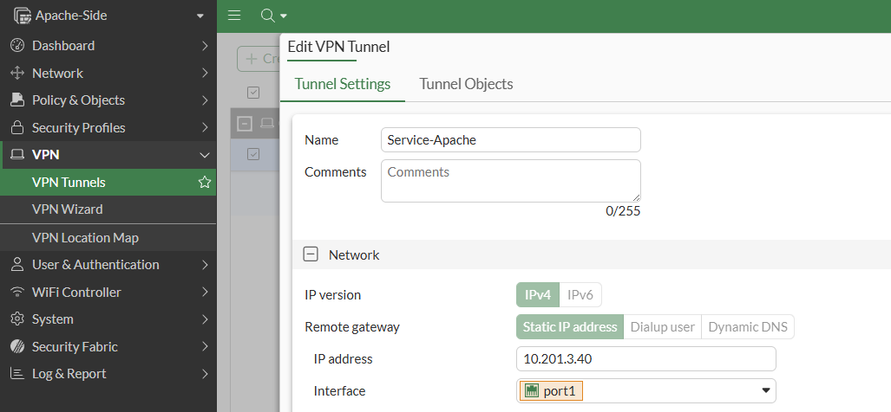

Se configuran los parámetros de seguridad: algoritmos de cifrado, Hash y grupos Diffie-Hellman, junto con la clave precompartida (Pre-shared Key). Es vital que estos parámetros coincidan en ambos extremos.

### 2.3. Configuración de Selectores de Tráfico (Fase 2)
A diferencia de un túnel convencional, aquí los selectores de tráfico (Quick Mode Selectors) utilizan las direcciones mapeadas:
* **Local Address:** IP mapeada del servidor (`172.118.1.10`).
* **Remote Address:** IP mapeada del cliente (`172.117.1.40`).

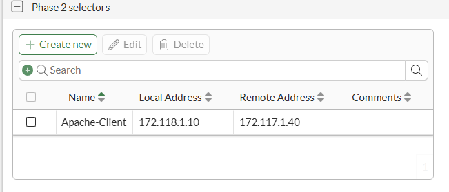

## 3. Configuración del Lado del Cliente (Client-Side)

Se replica la configuración de la VPN en el FortiGate del cliente, invirtiendo las direcciones de Gateway y los selectores de tráfico de la Fase 2 (Local vs Remoto).

### 3.1. Creación del IP Pool
Para enmascarar la identidad del cliente, se crea un **IP Pool**. Esto permitirá que el tráfico originado en la red local del cliente salga hacia la VPN con una dirección IP controlada.

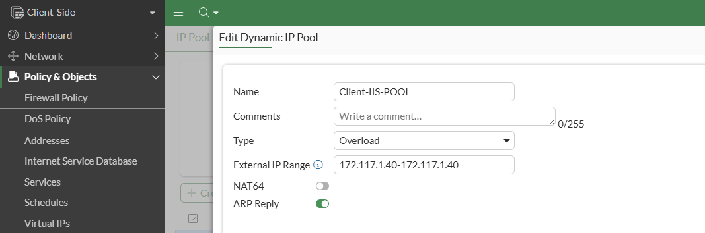

## 4. Políticas de Firewall y Enrutamiento

### 4.1. Políticas en el Servidor
Se crea una política que permite el tráfico desde la interfaz VPN hacia la LAN interna. 
* **Origen:** Objeto de red del cliente mapeado (`172.117.1.40`).
* **Destino:** La **VIP** creada en el paso 2.1.

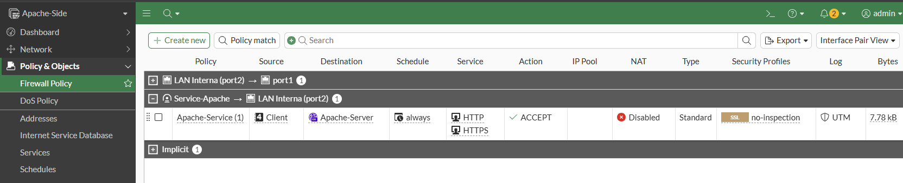

### 4.2. Políticas en el Cliente
Se configura la política de salida para permitir el tráfico desde la IP real del cliente (`10.0.2.10`) hacia la IP mapeada del servidor (`172.118.1.10`). Se habilita **NAT** utilizando el **IP Pool** dinámico configurado anteriormente.

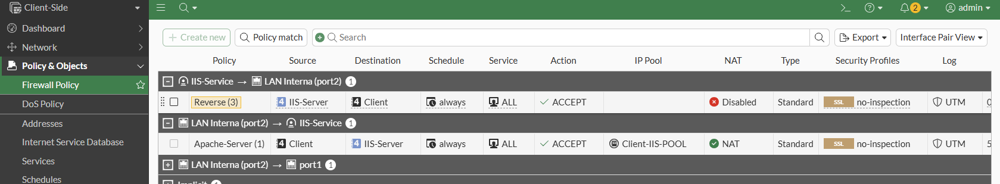

### 4.3. Rutas Estáticas
Para que los firewalls sepan cómo alcanzar las redes mapeadas a través del túnel, se configuran rutas estáticas apuntando a la interfaz virtual de la VPN.

**Ruta en FortiGate Apache-Side:**
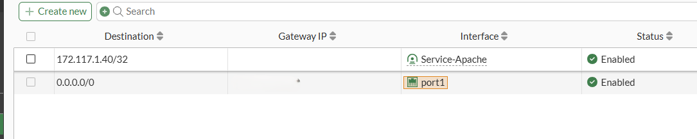

**Ruta en FortiGate Client-Side:**
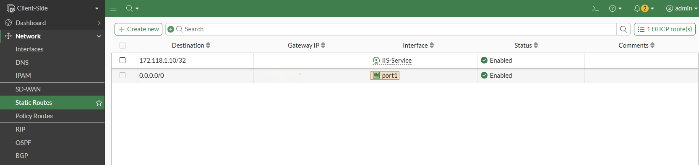

## 5. Verificación del Estado del Túnel

Una vez aplicadas las políticas y rutas, el túnel IPsec debería establecerse correctamente.

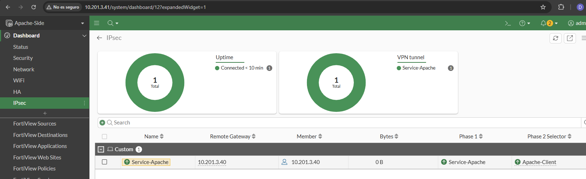

## 6. Comprobación y Pruebas de Conectividad

### 6.1. Acceso Web
Desde el equipo cliente, se intenta el acceso mediante la dirección IP mapeada y el puerto configurado en el Port Forwarding (`http://172.118.1.10:8080`).

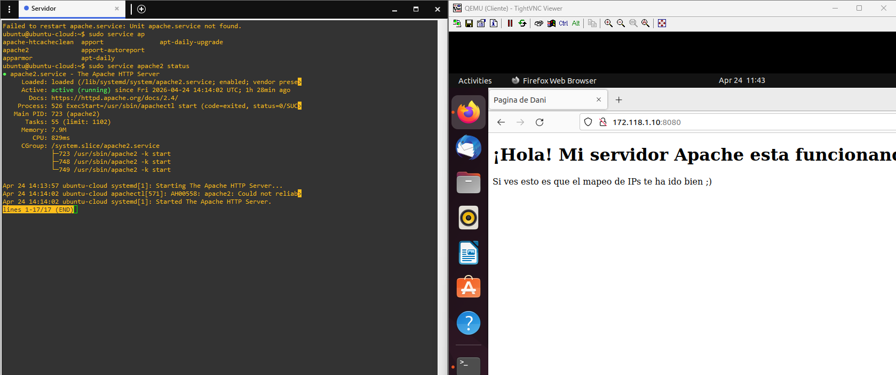

### 6.2. Análisis de Tráfico (Sniffer)
Utilizando el sniffer de paquetes por CLI en el FortiGate del servidor, se observa el proceso de *three-way handshake*. Se confirma que la IP
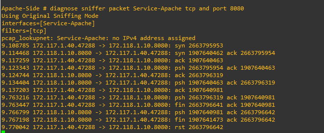