# FORTINET VPN IPSEC & SD-WAN

## 🌐 Topología

El objetivo del laboratorio consiste en que un cliente **Ubuntu** desde una LAN interna se comunique con internet a través de su puerta de enlace (**FortiGate Interno**) y que este tenga configurado una **SD-WAN** que conste de dos miembros VPN que conecten al otro par **FortiGate Perimetral**. Este último proporcionará la ruta de salida a internet ya que se conecta directamente con la nube (mi red desde la que hago este laboratorio).

---

## 🔒 VPN

Las VPN las creo de manera custom (sin wizard) y consiste en dos VPN para poder crear el SD-WAN:
* `To_Lan`
* `To_Lan2`

En los dos pares se tiene que configurar la misma **pre-shared key**, además de los protocolos de **cifrado** y **hash**. Al ser licencias VM de Fortinet no nos deja aplicar mucha seguridad, por lo que configuro en cada par `DES` - `SHA512` y protocolo `Diffie-Hellman 14`.

La captura que muestro es de la configuración `To_LAN` del FortiGate interno. Como se ve, aplico el gateway remoto y por la interfaz que lo va a encontrar; la IP del gateway remoto tiene que ser la IP de la interfaz del par con el que se quiere establecer conexión.

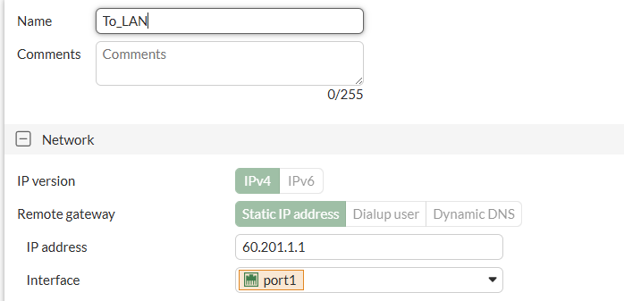

Además, en la **Fase 2** se configura tu IP local que en este caso es la LAN interna (`10.0.1.0/24`) y la LAN remota a la que quieres acceder a través de esa VPN, que al ser internet he dejado `0.0.0.0/0`. 

En el FortiGate perimetral esto se cambiaría. Además, en la Fase 2 se configuran igual los protocolos de encriptación y hash que, como he mencionado antes, tienen que ser iguales en los dos pares para que las interfaces levanten.

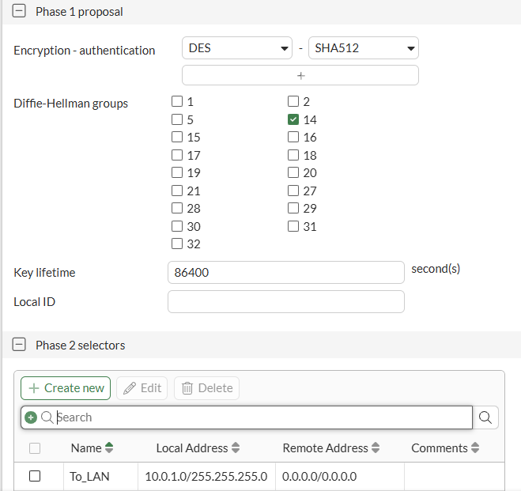

Para la interfaz `To_Lan2` se hace exactamente lo mismo excepto la IP del gateway que, al ser una interfaz distinta, la IP también lo es.

---

### 🚦 Políticas y Enrutamiento

Para que el tráfico pueda pasar por las VPN se necesita una política que lo permita, tanto de entrada como de salida.

**FortiGate Perimetral:**
Tenemos la primera política que sería `from_lan`, es lo equivalente a la política de internet; va a admitir todo lo que entre por cualquiera de las dos VPN y salga por la interfaz `WAN`. En este caso habilitamos el **NAT** para que a los equipos de mi red local, cuando les llegue un paquete del Ubuntu, salga con la IP de salida del FortiGate perimetral y estos sepan devolver el paquete. Se debe hacer lo mismo de forma reversa pero deshabilitando el NAT.

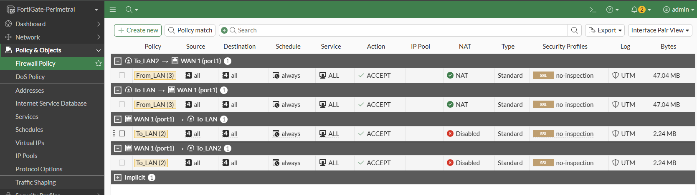

**FortiGate de la LAN:**
Se debe hacer algo parecido lo único que deshabilitando el NAT. En mi caso, como tengo la SD-WAN creada ya, en la policy se ve dicha interfaz, pero abarca las dos VPN por lo que aplica a las dos; es decir, se admite todo el tráfico que venga del puerto de la LAN interna y que salga por la SD-WAN (cualquiera de las 2 VPN), al igual que se permite el tráfico de forma reversa.

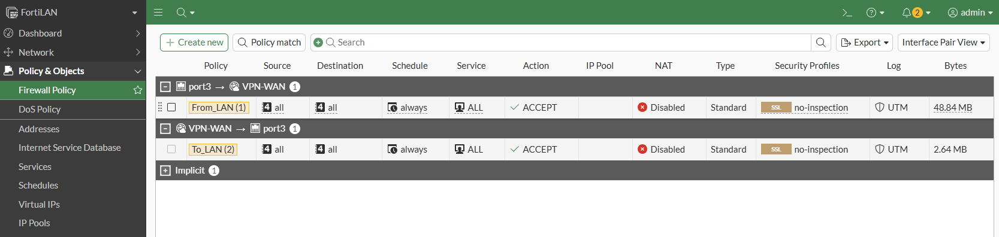

**Rutas:**
El FortiGate de la LAN necesita una **ruta estática** para que cualquier paquete que el Forti no tenga en su tabla de enrutamiento lo mande por la SD-WAN, es decir, cualquiera de las VPN.

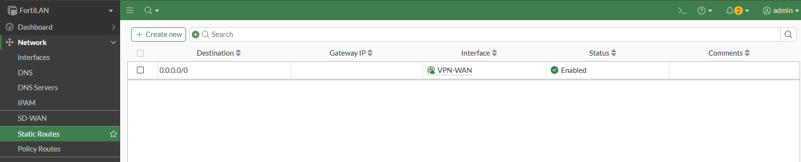

Por otro lado, el FortiGate perimetral al no tener SD-WAN se tiene que configurar una ruta a la LAN interna por cada interfaz VPN con misma prioridad y distancia para tener el **ECMP**, ya que si tenemos solo una interfaz activa y la otra no, solo va a saber devolver el tráfico que salga por su lado. Por otro lado tenemos la ruta estática de internet.

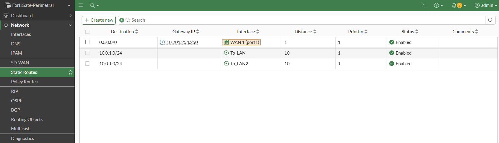

Una vez el tráfico es admitido y el FortiGate sabe por dónde enviarlo, podemos levantar las interfaces desde el dashboard. Si se levantan, significa que la creación de los túneles ha sido exitosa.

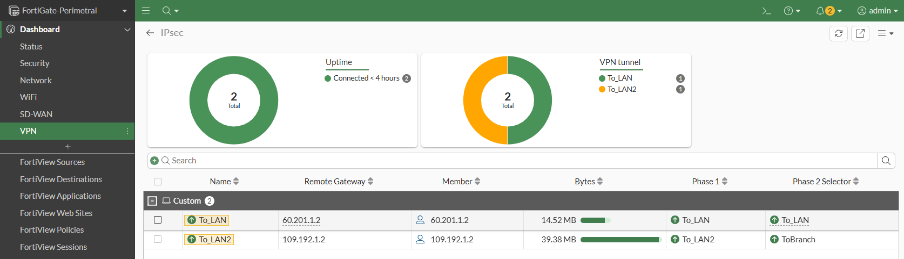

---

## ⚡ SD-WAN

Una vez tenemos las interfaces virtuales levantadas podemos crear una **Zona SD-WAN** y agregarlas como miembros para balancear el tráfico hacia internet.

En este caso se ve cómo creo una nueva zona y añado las dos interfaces VPN:

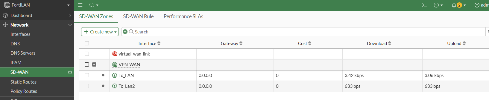

### Performance SLA
Una vez creada la zona, creo un **Performance_SLA** que mide el rendimiento de los miembros SD-WAN enviando tráfico a un servidor (en mi caso `8.8.8.8`). Podemos establecer valores normales de *jitter*, *delay* y *packet loss* para formar una especie de "baseline".

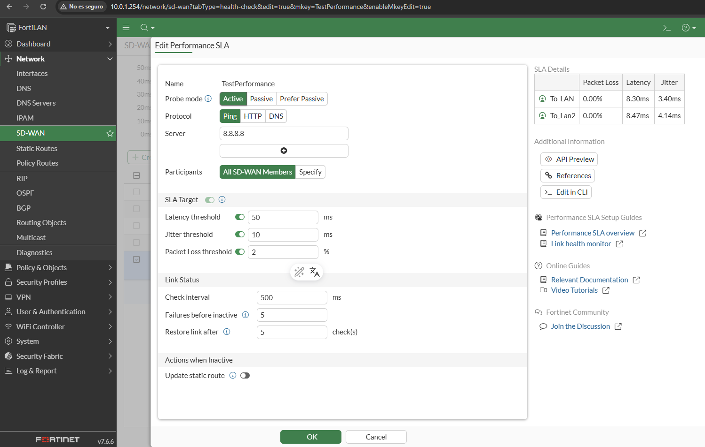

Una vez creado, podemos ir comprobando el estado de las interfaces en función de la pérdida de paquetes, delay y jitter.

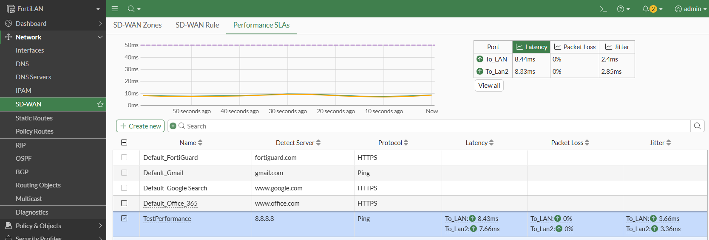

### SD-WAN Rules
Se pueden crear reglas en el SD-WAN para que se balancee el tráfico por los miembros en función de la calidad del tráfico o rendimiento. Por ejemplo, si hacemos una política que prioriza el rendimiento, el miembro que más peso tiene es el que menos delay y jitter tiene; en cambio, si hacemos una política de prioridad, la interfaz que más peso tiene es la que menos pérdida de paquetes tiene.

En mi caso he creado una política de **Lowest Cost**, es decir, la interfaz que más peso tiene es la que más rendimiento me puede ofrecer.

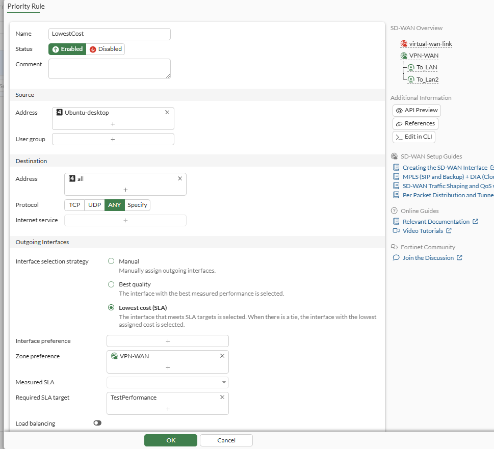

En el dashboard y el widget de SD-WAN que he creado se puede ver los miembros de la zona y el porcentaje de tráfico que cada uno está recibiendo/enviando.

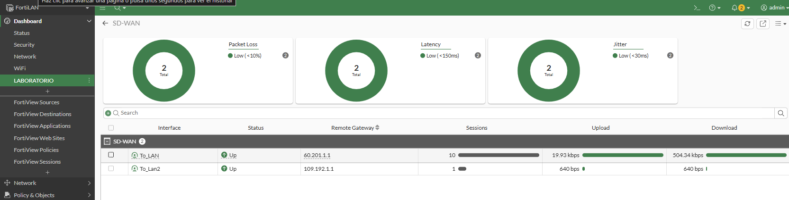

---

## 🧪 Prueba de Conectividad

La hora de la verdad: cuando ya tenemos todo en orden, hago **ping** desde mi equipo a Google (que es un servidor en internet) y este me da respuesta.

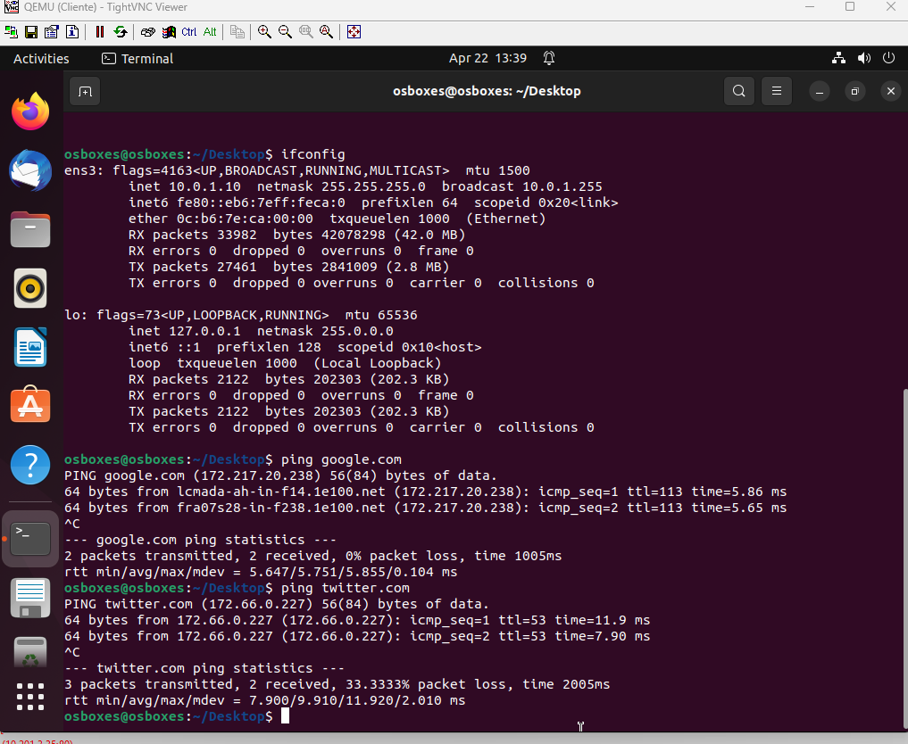
