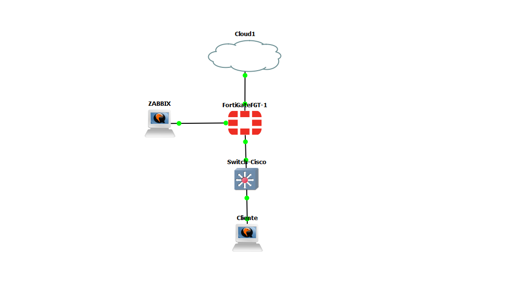
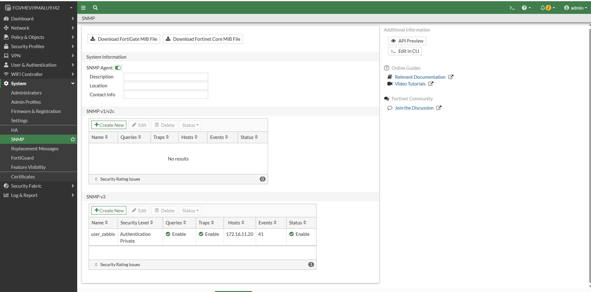
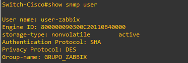
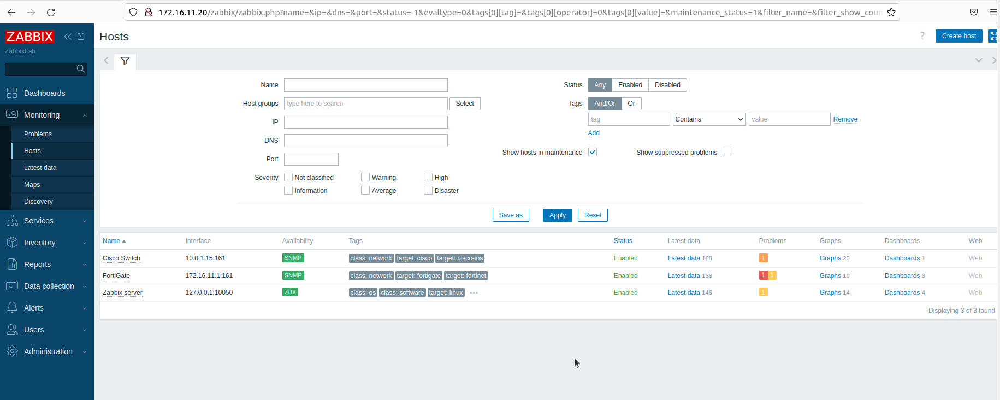
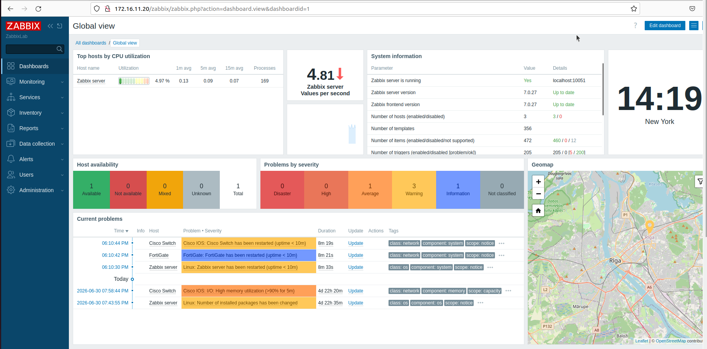
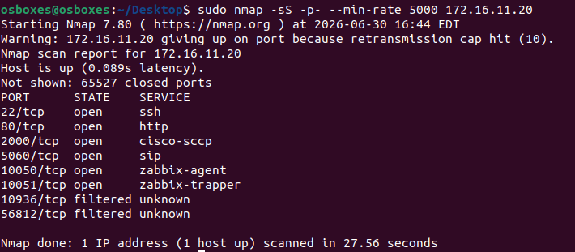
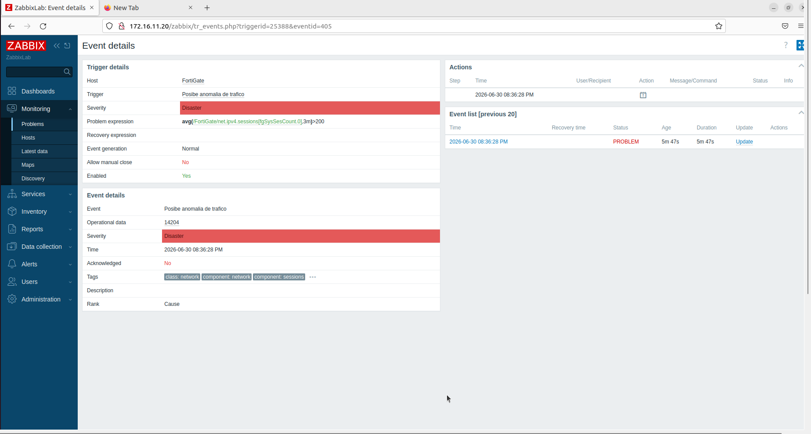
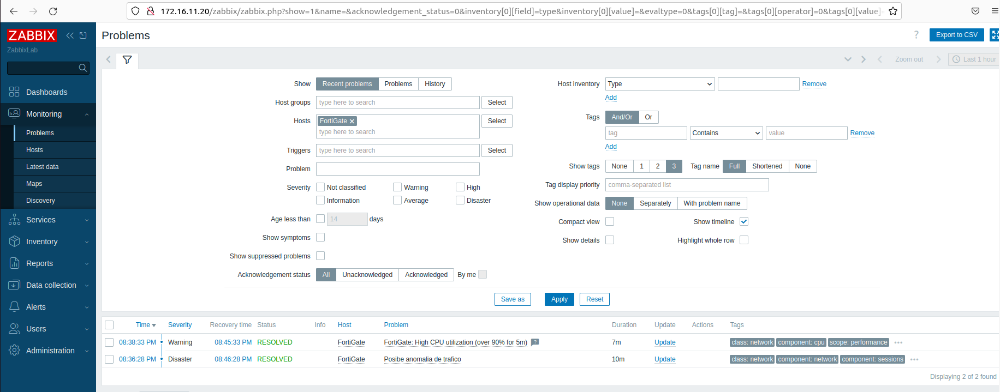

# 🛡️ Laboratorio Fortinet + Zabbix (Monitorización y Detección de Amenazas)

Este repositorio documenta la integración de un **FortiGate** y un **Switch Cisco** con **Zabbix** como plataforma de monitorización. El objetivo es recolectar métricas de los dispositivos de red vía **SNMPv3** y, a partir de ellas, crear **triggers** personalizados que generen alarmas ante eventos de seguridad y rendimiento: un **escaneo de puertos** (detectado por el aumento anómalo de sesiones), una **alta utilización de CPU**, etc.

De esta forma, Zabbix no solo actúa como sistema de observabilidad, sino como una primera línea de detección que permite reaccionar ante comportamientos sospechosos en la red.

---

## 🏗️ Topología

La topología desplegada en GNS3 sitúa al **FortiGate** como equipo perimetral entre la red interna y el exterior (`Cloud1`). El servidor **Zabbix** se conecta directamente al FortiGate y monitoriza tanto al propio firewall como al **Switch Cisco** situado por debajo. Un **Cliente** cuelga del switch y se utiliza para generar tráfico y ejecutar las pruebas.



**Flujo de la monitorización:**
1. El **FortiGate** y el **Switch Cisco** exponen sus métricas mediante un agente **SNMPv3**.
2. El servidor **Zabbix** (`172.16.11.20`) consulta periódicamente esos dispositivos y almacena los datos (*items*).
3. Los **triggers** evalúan las métricas recogidas y, al superar un umbral, generan un **problema**.
4. El problema se refleja en el dashboard y puede desencadenar acciones de alerta.

---

## 🔐 Configuración de SNMPv3

Se utiliza **SNMPv3** en lugar de v1/v2c porque incorpora **autenticación** e **cifrado (privacidad)**, evitando que las credenciales o las métricas viajen en texto claro por la red.

> [!IMPORTANT]
> Los parámetros de SNMPv3 (usuario, protocolo de autenticación y protocolo de privacidad) deben coincidir **exactamente** en el dispositivo y en la configuración del host de Zabbix. Cualquier discrepancia hará que Zabbix no reciba datos y la interfaz aparezca como *no disponible*.

### Paso 1: SNMP en el FortiGate

En el FortiGate se habilita el **SNMP Agent** y se crea un usuario **SNMP v3** llamado `user_zabbix` con nivel de seguridad **Authentication + Private** (autenticación y cifrado). Como *Host* se indica la IP del servidor Zabbix (`172.16.11.20`), que será el único autorizado a consultar el agente.



### Paso 2: SNMP en el Switch Cisco

En el Switch Cisco se configura el mismo usuario dentro de un grupo SNMPv3. Con el comando `show snmp user` se verifica que el usuario `user-zabbix` está activo, con protocolo de autenticación **SHA**, protocolo de privacidad **DES** y perteneciente al grupo `GRUPO_ZABBIX`.



---

## 🖥️ Alta de Hosts en Zabbix

Con el SNMP configurado en los dispositivos, se dan de alta los **hosts** en Zabbix. Cada host usa la interfaz y plantilla adecuada:

| Host | Interfaz | Tipo | Plantilla / Clase |
|---|---|---|---|
| Cisco Switch | `10.0.1.15:161` | SNMP | class: network / target: cisco-ios |
| FortiGate | `172.16.11.1:161` | SNMP | class: network / target: fortinet |
| Zabbix server | `127.0.0.1:10050` | Zabbix Agent | class: os / target: linux |



> [!TIP]
> Zabbix incluye plantillas oficiales para **FortiGate** y **Cisco IOS** por SNMP. Al asociarlas al host se importan automáticamente decenas de *items* (CPU, memoria, sesiones, estado de interfaces...) y triggers predefinidos, ahorrando gran parte de la configuración manual.

---

## 📊 Panel de Control (Dashboard)

Se ha configurado el dashboard **Global view** para tener una visión centralizada del estado del laboratorio: los hosts con mayor uso de CPU, la información del sistema (Zabbix 7.0.27), la disponibilidad de los equipos y los problemas actuales agrupados por severidad.



---

## 🧪 Pruebas de Detección

### Prueba 1: Detección de un Escaneo de Puertos

Desde una máquina Linux se lanza un escaneo agresivo con **Nmap** contra el servidor (`nmap -sS -p- --min-rate 5000 172.16.11.20`). El escaneo abre y prueba una gran cantidad de conexiones en muy poco tiempo, revelando los puertos abiertos (SSH, HTTP, Zabbix-agent, Zabbix-trapper, etc.).



Este comportamiento provoca un **pico repentino en el número de sesiones** que atraviesan el FortiGate, que es precisamente la métrica sobre la que se ha construido el trigger de detección.

### Prueba 2: Trigger de Anomalía de Tráfico Disparado

Se ha creado un trigger personalizado sobre el host **FortiGate** llamado **"Posible anomalia de trafico"**, con severidad **Disaster**. Su expresión evalúa el número medio de sesiones IPv4 durante los últimos 3 minutos y salta si supera las 200:

```
avg(/FortiGate/net.ipv4.sessions[fgSysSesCount.0],3m)>200
```

Cuando el escaneo eleva el contador de sesiones por encima del umbral, el trigger se dispara y Zabbix genera el evento con todos sus detalles.



> [!TIP]
> Usar una **media móvil** (`avg` sobre 3 minutos) en lugar del valor instantáneo evita falsos positivos por picos puntuales de tráfico legítimo, ya que solo se dispara cuando la anomalía se mantiene en el tiempo.

### Prueba 3: Alarma de Alta Utilización de CPU

Además del trigger de tráfico, se aprovecha el trigger de **"High CPU utilization (over 90% for 5m)"** de la plantilla del FortiGate. Al forzar carga sobre el firewall, el uso de CPU supera el 90 % durante 5 minutos y se genera una alarma de severidad **Warning**.

### Prueba 4: Gestión y Resolución de Problemas

Una vez que las condiciones vuelven a la normalidad (finaliza el escaneo y baja la CPU), Zabbix marca automáticamente los problemas como **RESOLVED**, registrando la hora de inicio, la de recuperación y la duración total de cada incidente.



---

## 🎯 Conclusión

Con este laboratorio se ha demostrado cómo integrar dispositivos **Fortinet** y **Cisco** con **Zabbix** mediante **SNMPv3** para construir un sistema de monitorización y detección temprana de amenazas. Partiendo de las métricas recogidas del FortiGate, se ha creado un trigger capaz de identificar un **escaneo de puertos** a través del incremento anómalo de sesiones, además de aprovechar los triggers de plantilla para vigilar el **rendimiento** (CPU) de los equipos.

La principal ventaja de este enfoque es que convierte a Zabbix en algo más que un panel de gráficas: al modelar el comportamiento "normal" de la red y alertar sobre las desviaciones, permite detectar de forma proactiva actividades sospechosas como los escaneos de reconocimiento, que suelen ser la fase previa a un ataque real. Todo el ciclo —detección, alarma y resolución— queda registrado y es auditable desde el dashboard.
